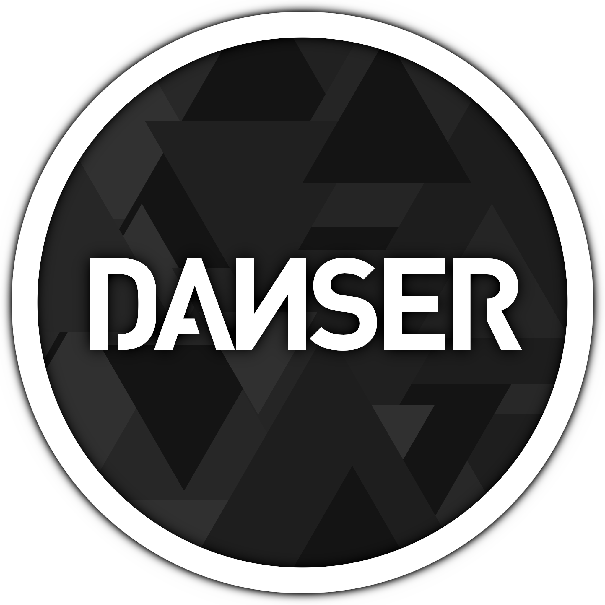

<p align="center">
  
</p>

# danser-go

[](https://github.com/Wieku/danser-go/releases/latest)
[](https://github.com/Wieku/danser-go/releases)
[](https://www.codefactor.io/repository/github/wieku/danser-go)
[](https://discord.gg/UTPvbe8)

danser-go is a GUI/CLI visualisation tool for osu!standard maps.

As danser is in development phase, some things may break. If that happens please fill an issue with as much detail as possible.

**WARNING**: Because of MacOS' poor OpenGL support, danser-go won't run on that platform. Please use dual-booted Windows/Linux instead.

## Examples
* [Omoi - Chiisana Koi no Uta (Synth Rock Cover) [Kroytz's EX EX] - TAG2 Mirror Collage](https://youtu.be/Vo0Pbpu113Y)
* [Sex Whales & Fraxo - Dead To Me (feat. Lox Chatterbox) [extrad1881 (ar 10)] Mirror Collage](https://youtu.be/KCHqrVGdXrk)
* [Nightcore - Flower Dance [Amachoco ARX.7] Mandala Mirror Collage](https://youtu.be/HBC89S-UwFc)
* [Flower Dance (osu! cursordance)](https://youtu.be/lcnnz3fN3bs)
* [osu! top 50 replays knockout | xi - FREEDOM DiVE [ENDLESS DiMENSiONS]](https://youtu.be/kzr_Sr0Shuc)
* [osu! top 50 knockout | YURRY CANNON - Suicide Parade [Sakase]](https://youtu.be/GS_yoq5MJMU)
* [osu! top 50 replays knockout | Kobaryo - Bookmaker [Corrupt The World]](https://youtu.be/SJqkP1IDUq0)

## Running Danser

You can download the newest Windows/Linux 64-bit binaries from [releases](https://github.com/Wieku/danser-go/releases).

After unpacking it to your desired directory, you need to run it using launcher (using `danser` executable) or
a command-line application/terminal:

##### Windows cmd:
```bash
danser-cli <arguments>
```

##### Linux / Unix / git bash / Powershell:
```bash
./danser-cli <arguments>
```

If you try to run *danser-cli* without any arguments there's a surprise waiting for you ;)

## Run arguments
* `-artist="NOMA"` or `-a="NOMA"`
* `-title="Brain Power"` or `-t="Brain Power"`
* `-difficulty="Overdrive"` or `-d="Overdrive"`
* `-creator="Skystar"` or `-c="Skystar"`
* `-md5=hash` - overrides all map selection arguments and attempts to find `.osu` file matching the specified MD5 hash
* `-id=433005` - overrides all map selection arguments and attempts to find `.osu` file with matching BeatmapID (not BeatmapSetID!)
* `-cursors=2` - number of cursors used in mirror collage
* `-tag=2` - number of cursors in TAG mode
* `-speed=1.5` - music speed. Value of 1.5 is equal to osu!'s DoubleTime mod. Ignored if in `-play` mode with speed changing mods
* `-pitch=1.5` - music pitch. Value of 1.5 is equal to osu!'s Nightcore pitch. To recreate osu!'s Nightcore mod, use
  with speed 1.5
* `-settings=name` - settings filename - for example `settings/name.json` instead of `settings/default.json`
* `-debug` - shows additional info when running Danser, overrides `Graphics.DrawFPS` setting
* `-play` - play through the map in osu!standard mode
* `-skip` - skips map's intro like in osu!
* `-start=20.5` - start the map at a given time (in seconds)
* `-end=30.5` - end the map at the given time (in seconds)
* `-knockout` - knockout mode
* `-knockout2="[\"replay1.osr\",\"replay2.osr\"]"` - knockout mode, but instead of using danser's replays folder,
  sources replays from the given JSON array. `Knockout.MaxPlayers` and `Knockout.ExcludeMods` settings are ignored.
* `-record` - Records danser's output to a video file. Needs an
  accessible [FFmpeg](https://github.com/Wieku/danser-go/wiki/FFmpeg) installation.
* `-out=abcd` - overrides `-record` flag, records to a given filename instead of auto-generating it. Extension of the
  file is set in settings. When the `-ss` flag is used, this sets the output filename as well.
* `-replay="path_to_replay.osr"` or `-r="path_to_replay.osr"` - plays a given replay file. Be sure to replace `\`
  with `\\` or `/`. Overrides all map selection arguments
* `-mods=HDHR` - displays the map with given mods. `-mods=AT` will
  trigger cursordance with replay UI. If specified, it will override `-replay` mods
* `-mods2="[{\"acronym\":\"DT\",\"settings\":{\"speed_change\":1.2}},{\"acronym\":\"HD\"}]"` - displays the map with given mods. It's using lazer's mod structure to support mod settings. If specified, it will override `-replay` mods. As above, adding AT will
  trigger cursordance with replay UI
* `-skin` - overrides `Skin.CurrentSkin` in settings
* `-cs`, `-ar`, `-od`, `-hp` - overrides maps' difficulty settings (values outside of osu!'s normal limits accepted). Ignored if DA (Difficulty Adjust) mod is specified in `-mods2`
* `-nodbcheck` - skips updating the database with new, changed or deleted maps
* `-noupdatecheck` - skips checking GitHub for a newer version of danser
* `-ss=20.5` - creates a screenshot at the given time in .png format
* `-quickstart` - skips intro (`-skip` flag), sets `LeadInTime` and `LeadInHold` to 0.
* `-offset=20` - local audio offset in ms, applies to recordings unlike `Audio.Offset`. ~~Inverted compared to stable~~ not anymore.
* `-preciseprogress` - prints record progress in 1% increments.

Examples which should give the same result:

```bash
<executable> -d="Overdrive" -tag=2 //Assuming that there is only ONE map with "Overdrive" as its difficulty name

<executable> -t="Brain Power" -d="Overdrive" -tag=2

<executable> -t "Brain Power" -d Overdrive -tag 2

<executable> -t="ain pow" -difficulty="rdrive" -tag=2

<executable> -md5=59f3708114c73b2334ad18f31ef49046 -tag=2

<executable> -id=933228 -tag=2
```

Settings and knockout usage are detailed in the [wiki](https://github.com/Wieku/danser-go/wiki).

## Building the project
You need to clone it or download as a .zip (and unpack it to desired directory)

#### Prerequisites

* [64-bit go (1.22 at least)](https://go.dev/dl/)
* gcc/g++ (Linux/Unix), [WinLibs](http://winlibs.com/) MSVCRT+POSIX (Windows, TDM-GCC won't work, mingw-w64 is outdated)
* OpenGL library (shipped with drivers, `libgl1-mesa-dev` when building on Linux servers)
* xorg-dev, libgtk-3 and libgtk-3-dev (Linux)

#### Building and running the project

First, enter the cloned/downloaded repository.

When you're running it for the first time or if you made any changes type:

```bash
go build
```

This will automatically download and build needed dependencies.

Afterwards type:

```bash
./danser-go <arguments>
```

Running without arguments (as opposed in [Running Danser](#running-danser)) will give you the launcher, though you can't
use drag&drop on the executable to preload a replay. If that ability is desired, build danser using dist scripts.


## Credits and License

Software created by Sebastian Krajewski ([@Wieku](https://github.com/Wieku)) and [contributors](https://github.com/Wieku/danser-go/graphs/contributors)

Unless stated otherwise, source files are distributed under GNU General Public License v3.0

Full credits and licenses of 3rd party assets can be found [here](CREDITS.md).
